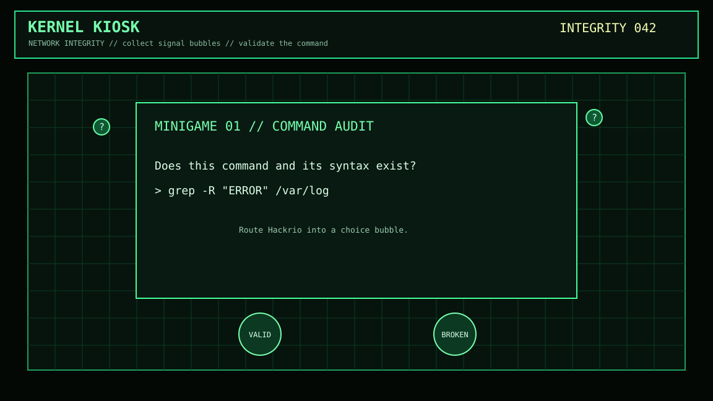

# Kernel Kiosk

Kernel Kiosk is a fast terminal-floor arcade game made in Godot 4. Guide the code-drawn Hackrio terminal avatar through a live network grid, collect signal bubbles, and decide whether the recovered Linux command is real before the clock burns down.



## Play

Move with **A/D** or the **arrow keys** and jump with **Space**, **W**, or **Up**. Hackrio is a side-view platform runner: use terminal blocks as platforms, touch a signal bubble to reveal its prompt, then jump into the answer bubble.

There are two minigames:

- **Command Audit**: classify a command as valid or broken by jumping into a randomized in-world signal bubble.
- **Flag Forge**: choose the real flag or command fragment that completes a Linux command from randomized platform positions.

Each run samples **10 unique questions** from each level's 30-question deck, so a campaign contains 30 questions and does not repeat the same sequence every time. Level 1 awards **5 score** per correct answer, Level 2 awards **10**, and Level 3 awards **15**. Every correct answer also restores **3 health**. A wrong answer deducts **2 score** and **5 health**. Health begins at 25, is capped at 25, and reaching zero ends the session. Clear all three levels to receive root access.

## Features

- Original green-terminal arena and Hackrio avatar, drawn at runtime without asset packs.
- Proximity-only command reveal, followed by physical bubble selection for command audits.
- Three 30-question difficulty decks; each run selects 10 unique questions from every deck.
- Firewall-reconfiguration transition effect and progressively narrower, gapped platform routes.
- Separate score and 25-point health systems, with green/red result flashes and health-based death.
- Separate original Godot scenes for root-access victory and connection-terminated defeat.
- Optional public-score submission with player-selected display names.

## Run the Web Build

The game and server live in the same source tree. Godot creates the browser bundle; the Go server serves that bundle and the public scoreboard.

```sh
GODOT=godot make export-web
make run
```

Open [http://localhost:8009](http://localhost:8009) to play and [http://localhost:8009/rankings.html](http://localhost:8009/rankings.html) to view published scores. The export command requires Godot 4.3+; the server itself only requires Go 1.23+.

The server binds to `127.0.0.1:8009` by default. For a reverse proxy or LAN deployment, pass an explicit address such as `go run ./cmd/kernel-kiosk -addr :8009`.

### One-command setup

On Unix/Linux systems, the setup script installs missing Godot, Go, and `make` through Homebrew, `apt`, `dnf`, `pacman`, `apk`, or `zypper`. It then installs Godot's matching Web export templates, exports the browser game, tests the server source, and builds a native binary for the current CPU. Linux installs may request `sudo`. Godot's current official template bundle contains all platform templates and can be a large one-time download; interrupted downloads resume on the next setup run:

```sh
./setup.sh
./bin/kernel-kiosk
```

Use `./setup.sh --skip-export` only when `web/index.html` has already been exported.

## Score Privacy

Everything in gameplay runs locally in the browser or desktop client. No player data is transmitted while playing. At the end, players may choose **Publish Score**, enter a public display name, and open a separate rankings page that submits only that name and final score using one GET request. The result screen and play HUD both include **Rankings** controls that open the page in a new tab. Scores are persisted by the included Go server and publicly listed at `/rankings.html`.

## Run locally

1. Install [Godot 4.3 or newer](https://godotengine.org/download/).
2. Import `project.godot` in Godot.
3. Press `F6` / `F5` to play.

For a lightweight web deployment, run `GODOT=godot make export-web`, then deploy the Go binary with its generated `web/` folder. The renderer is explicitly configured for the compatibility backend, keeping GPU and memory requirements modest for low-end devices.

### CPU architecture builds

```sh
make build-all
```

This produces Linux ARMv6, Linux ARM64, Linux AMD64, macOS Apple Silicon, and macOS Intel binaries in `bin/`. The Go server has no CGO, native libraries, containers, or architecture-specific dependencies.

### DietPi systemd service

After copying the ARMv6 binary and the generated `web/` directory to `/root/Hackclub/kernel-kiosk` on DietPi, install and start the included service:

```sh
scp deploy/kernel-kiosk.service root@DietPi:/etc/systemd/system/kernel-kiosk.service
ssh root@DietPi 'systemctl daemon-reload && systemctl enable --now kernel-kiosk && systemctl status kernel-kiosk'
```

The service listens on port `8009`, restarts after a failure, and stores scores at `/root/Hackclub/kernel-kiosk/data/scores.json`. Use `journalctl -u kernel-kiosk -f` to follow its logs.

## How It Works

The game is a single Godot scene. `main.gd` draws the grid, player, and bubbles directly with the Canvas API, then tracks proximity using simple distance checks. This keeps the frame work intentionally small: there are no physics bodies, animations, texture atlases, or continuous network calls. Game state is held in client memory and a browser export can be deployed as static files.

The optional scoreboard is intentionally separated from play. The game sends one URL-encoded GET request containing the chosen public name and final score after explicit confirmation. No name, score, or telemetry is sent otherwise. The rankings page is read-only; the server validates names and score bounds, persists only the top 50 scores atomically, has conservative HTTP timeouts, security headers, request logging, and graceful shutdown handling.

## Assets and Credits

All visual assets are original and generated in `main.gd` with Godot's drawing API: the grid, bubbles, terminal UI, and Hackrio avatar. No external artwork, audio, or asset packs are used.

Built for the Hack Club Stardance WarioWare mission.
