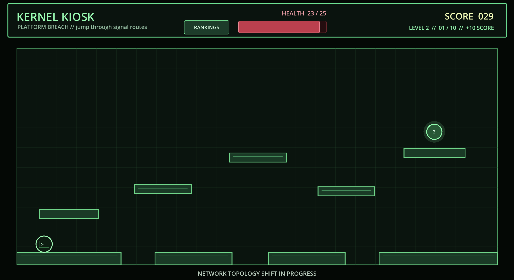

# Kernel Kiosk

Kernel Kiosk is a Godot 4 collection of Linux-command minigames. Choose either the platform route, where Hackrio jumps through signal bubbles, or the fixed terminal typing drill.



## What You Do

- Move with `A` / `D` or the arrow keys.
- Jump with `Space`, `W`, or Up.
- Get close to a signal bubble to reveal its challenge.
- Jump into one of the answer bubbles to make your choice.

Platform Breach has three movement levels with randomized signal challenges. Typing Terminal has three levels, each with a 50-question Linux deck; a run selects eight exact-input prompts from every deck for 24 questions total.

The first level asks whether a command is valid or broken. Later levels ask which flag or command fragment makes a command work. Correct answers add score and restore health; wrong answers cost both. Clear all three levels for the root-access ending, or let health reach zero for the connection-terminated ending.

## Features

- Side-view platforming with gravity, jumping, collisions, and increasingly awkward routes.
- Green terminal UI, signal bubbles, platforms, and Hackrio drawn directly in Godot code.
- A game selector with Platform Breach and Typing Terminal.
- Three randomized 50-question typing decks, with eight prompts per level.
- Firewall-reconfiguration transition between levels.
- Separate victory and defeat scenes made in Godot.
- Separate optional public rankings for each minigame, with player-chosen display names.
- A lightweight Go server that stores only the top 50 scores.

## Quick Start

### Run from source

You need Godot 4.3+, Go 1.23+, and `make`.

```sh
GODOT=godot make export-web
make run
```

Open [http://localhost:8009](http://localhost:8009). Rankings are available at [http://localhost:8009/rankings.html](http://localhost:8009/rankings.html).

### Use the setup script

On macOS or Linux, the setup script can install missing Go, Godot, and `make`, download the matching Godot web export templates, export the game, test the server, and build a binary for the current computer.

```sh
./setup.sh
./bin/kernel-kiosk
```

Use `./setup.sh --skip-export` only when `web/index.html` already exists.

## Useful Commands

```sh
make run          # Run the Go server from source
make test         # Run Go tests
make build        # Build for this computer
GODOT=godot make export-web
make build-all    # Build Linux ARMv6/ARM64/AMD64 and macOS ARM64/AMD64 binaries
```

The web export goes into `web/`. It is deliberately kept outside version control because it is generated. The server needs the whole exported `web/` directory beside it when deployed.

## Scores and Privacy

Playing the games does not send anything to the server. At the end of a run, the player can choose whether to publish a score. If they choose yes, the game sends only their selected public name, final score, and minigame identifier in one GET request.

The rankings page is read-only. It displays and stores the top 50 scores for each minigame in `data/scores.json`. The server validates display names and score ranges, uses atomic score-file writes, and includes request limits and security headers.

## Low-End Deployment

The game runs in the visitor's browser. The Pi only serves static Godot files and handles the optional leaderboard, so it is suitable for lower-powered devices.

For a Raspberry Pi Zero-class machine, build the ARMv6 binary:

```sh
make build-all
```

Copy `bin/kernel-kiosk-linux-armv6` to the Pi as `kernel-kiosk`, along with the complete `web/` folder. The included [systemd service](deploy/kernel-kiosk.service) starts the server automatically and restarts it if it stops.

The default server binds to `127.0.0.1:8009`. For a LAN server, run it with `-addr :8009`. For Cloudflare Tunnel, keep the loopback address and point the Tunnel hostname at `http://127.0.0.1:8009`.

## Project Layout

```text
game_select.gd              Minigame selector
main.gd                     Platform Breach gameplay
typing_game.gd              Fixed terminal typing gameplay
Main.tscn                   Main Godot scene
WinScene.tscn               Root-access victory scene
DeathScene.tscn             Connection-terminated defeat scene
result_scene.gd             Result buttons and optional score publishing
cmd/kernel-kiosk/           Go web server
internal/scores/            JSON leaderboard storage and tests
rankings.html               Read-only public leaderboard
setup.sh                    Unix/macOS setup helper
deploy/                     systemd service template
```

## Assets and Credits

All game visuals are original. The terminal grid, platforms, bubbles, UI, and Hackrio avatar are drawn using Godot's Canvas API. No asset packs, stock art, or external game artwork are used.

The project uses Godot for the game and Go's standard library for the server.
